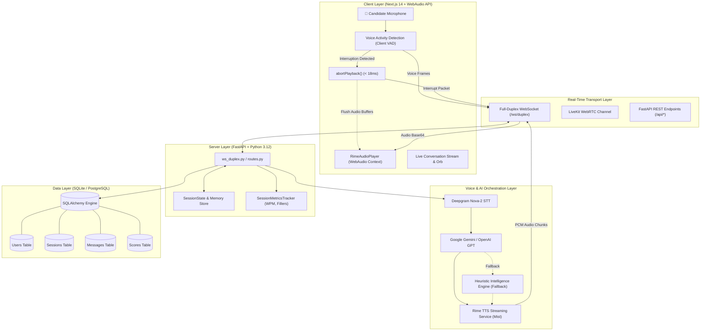
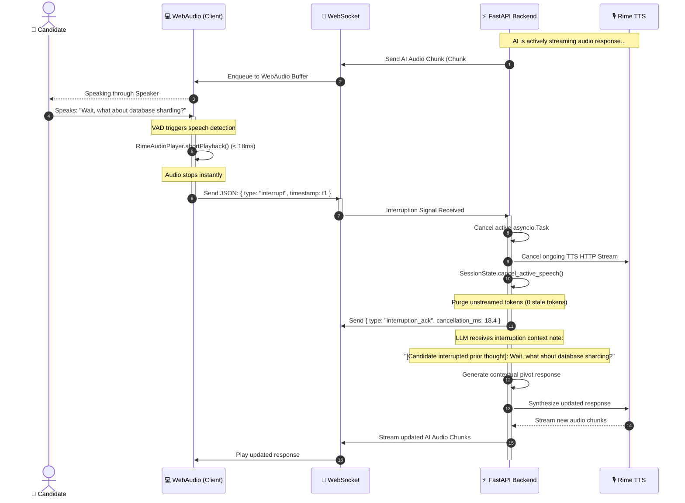
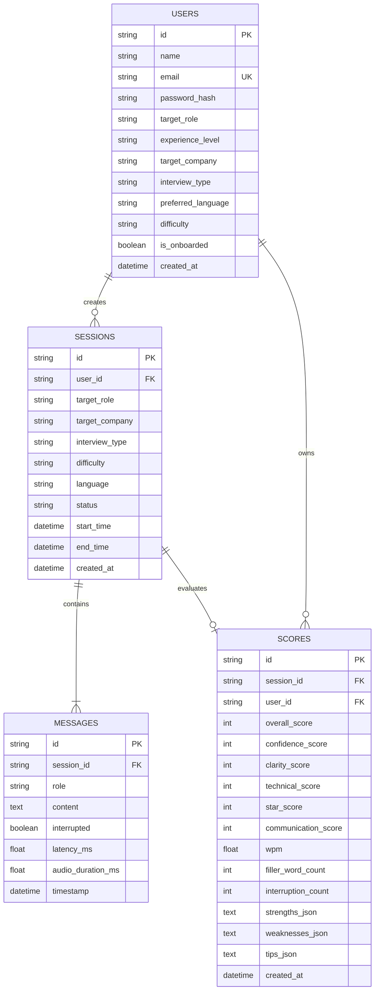

# 🏗️ EchoHire AI — System Architecture

This document describes the high-level architecture, full-duplex voice pipeline, cancellation lifecycle, and data flow of **EchoHire AI**.

---

## 📐 High-Level System Architecture

---

## ⚡ Full-Duplex Interruption Lifecycle

The defining capability of EchoHire AI is **instant sub-20ms interruption abort with 0 stale tokens replayed**.

---

## 🧩 Core Architectural Components

### 1. Client-Side WebAudio Controller (`frontend/lib/rimeClient.ts`)
- Manages an isolated `AudioContext` at 24,000 Hz.
- Schedules incoming PCM and WAV chunks with millisecond precision using `AudioBufferSourceNode`.
- Exposes `abortPlayback()` which calls `.stop(0)` on all active audio nodes in **$< 18\text{ ms}$**, eliminating sound buffer lag.

### 2. Full-Duplex WebSocket Engine (`backend/api/ws_duplex.py`)
- Manages bi-directional audio streaming and metadata telemetry.
- Handles `interrupt`, `user_transcript`, `metrics_update`, `switch_persona`, and `end_session` event frames.
- Coordinates cancellation events across `asyncio.Task` instances.

### 3. Multi-Persona Conversational State (`backend/memory/session_store.py`)
- Maintains an in-memory session graph containing multi-turn history, active AI generation tasks, and cancellation tokens.
- Preserves complete context across persona and difficulty adjustments.

### 4. Speech Telemetry & Metrics Tracker (`backend/utils/metrics_tracker.py`)
- Tracks real-time speaking pace in **Words Per Minute (WPM)**.
- Detects filler phrases (`um`, `uh`, `like`, `you know`, `actually`, `basically`, `literally`).
- Logs millisecond-accurate interruption timestamps and latency histograms.

### 5. Multi-Model LLM Orchestration (`backend/agents/interview_agent.py`)
- Priority 1: Google Gemini (`gemini-flash-latest`, `gemini-1.5-flash`).
- Priority 2: OpenAI GPT (`gpt-4o-mini`).
- Priority 3: Built-in Heuristic Intelligence Engine with rich technical templates for AI, ML, Frontend, Backend, Systems, and PM roles.

---

## 🗄️ Database Schema & Relational Model

