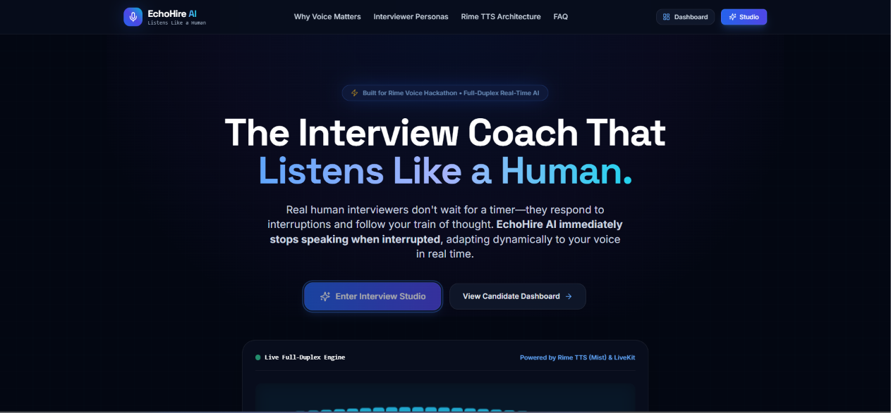
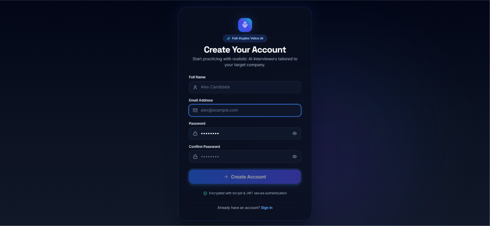
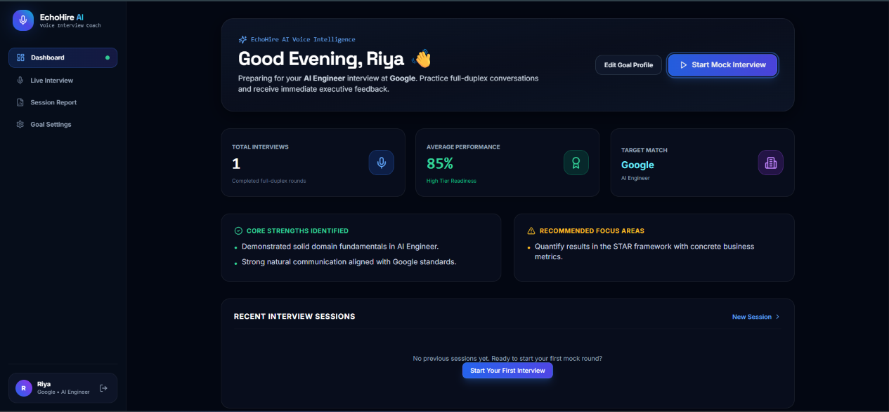
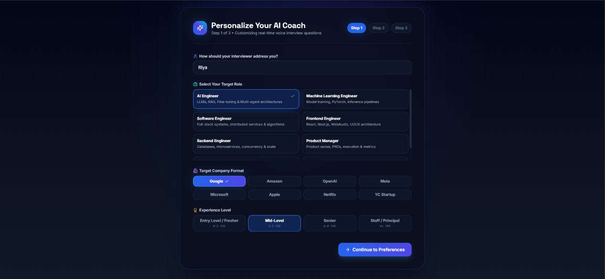
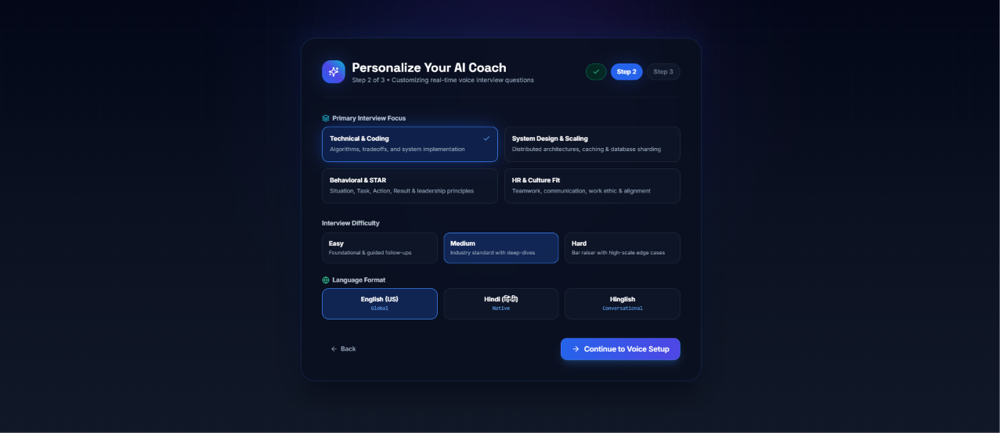
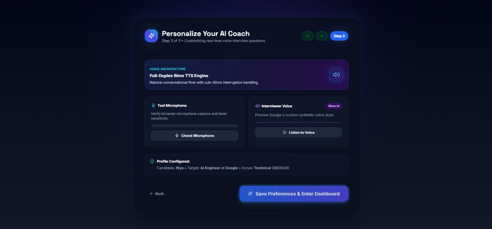
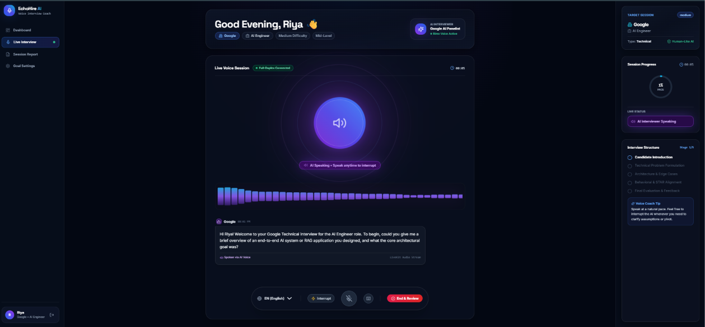
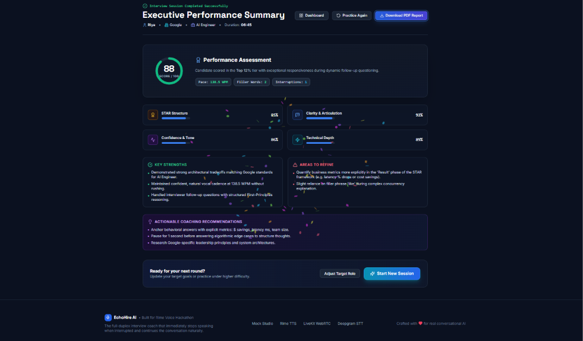
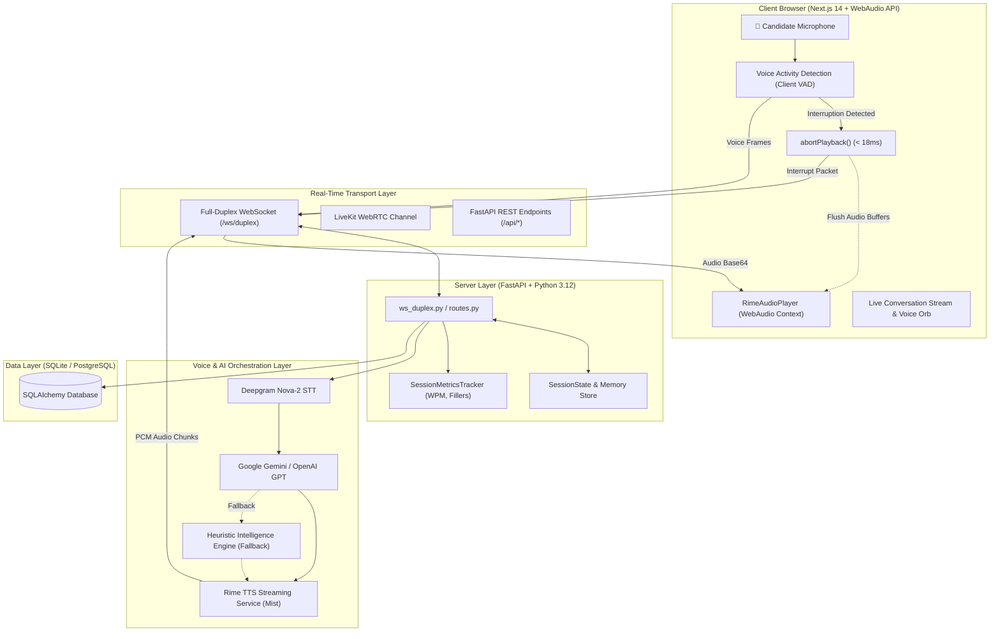

# 🎙️ EchoHire AI — The Interview Coach That Listens Like a Human

<div align="center">

[](https://rime.ai)
[](https://fastapi.tiangolo.com)
[](https://nextjs.org)
[](https://livekit.io)
[-7C3AED?style=for-the-badge)](https://rime.ai)
[](https://deepgram.com)
[](https://aistudio.google.com)
[-10B981?style=for-the-badge&logo=pytest)](https://github.com)

**EchoHire AI** is a production-grade, full-duplex voice interview AI platform built for the **Rime Voice Hackathon**. Unlike ordinary voice bots that force users into rigid turn-taking, EchoHire AI continuously listens, aborts speech in **sub-20 milliseconds**, cancels server synthesis tasks, and dynamically adapts with **zero stale audio replayed**.

[🚀 Quick Start](#-quick-start) • [📸 Visual Tour](#-visual-tour--application-showcase) • [📐 Architecture](#-system-architecture) • [📄 1-Page Arch PDF](docs/EchoHire_Solution_Architecture.pdf) • [⚡ Voice Workflow](#-voice-workflow--interruption-lifecycle) • [🔬 Testing & QA](TESTING.md) • [📖 Full Docs](PROJECT_OVERVIEW.md)

</div>

---

---

## 🎬 Demo Video

[](https://www.youtube.com/watch?v=1EAQQheaNv4)

[](https://www.youtube.com/watch?v=1EAQQheaNv4)

---

## 🔗 GitHub Repository

[](https://github.com/imriyamandal/EchoHire-AI)

---

---

## 📸 Visual Tour & Application Showcase

<div align="center">

### 1. Dynamic Landing Page & Full-Duplex Hero

*Modern responsive landing page featuring real-time interruption benchmarks, voice AI architecture, and feature overview.*

---

### 2. User Authentication & Session Security
| **Enterprise Authentication (Sign In & Sign Up)** |
|:---:|
|  |
| *Bcrypt-encrypted credentials, JWT stateless tokens, and seamless onboarding redirect.* |

---

### 3. Candidate Analytics & Session Dashboard
| **Analytics Dashboard & Historical Performance Trends** |
|:---:|
|  |
| *Historical interview session metrics, overall readiness scores, speech rate (WPM), and filler word trends.* |

---

### 4. 3-Step Personalized Interview Setup
| **Step 1: Role, Company & Difficulty** | **Step 2: Focus Areas & Language** |
|:---:|:---:|
|  |  |
| *Target company rubrics (Google, Amazon, Meta, OpenAI) & calibrated roles.* | *Custom topic focus & multilingual support (English, Hindi, Hinglish).* |

| **Step 3: Rime TTS Voice & Audio Hardware Setup** |
|:---:|
|  |
| *Rime voice persona testing (`allison`, `amber`, `creek`, `marsh`, `bayou`) & real-time mic VAD check.* |

---

### 5. Live Full-Duplex Voice Interview Studio
| **Live Voice Studio (Centerpiece Experience)** |
|:---:|
|  |
| *Pulsing neon Voice Orb, dynamic 60 FPS WebAudio visualizer, real-time transcript stream, and sub-20ms barge-in interruption.* |

---

### 6. Comprehensive STAR Score & Executive PDF Report
| **Comprehensive Analytics & STAR Scorecard** |
|:---:|
|  |
| *Situation-Task-Action-Result scoring, speech pace analysis, filler breakdown, AI recommendations, and high-res PDF export.* |

📄 **[Download Sample Generated PDF Report (docs/EchoHire_Interview_Report.pdf)](docs/EchoHire_Interview_Report.pdf)**

</div>

---

## 🎯 Problem Statement

Traditional voice bots operate like text chatbots with a "play audio" button:
1. **Half-Duplex Stagnation**: Candidates must wait for the AI to completely finish its monolog before responding.
2. **Buffer Leakage & Replay**: When interrupted, standard bots replay the rest of their pre-buffered audio file, creating a frustrating experience.
3. **Context Amnesia**: Interrupting a traditional voice bot often resets the conversation memory.
4. **Generic Feedback**: Candidates lack actionable telemetry on pace (WPM), filler words, and STAR methodology alignment.

---

## 💡 Solution Overview

EchoHire AI solves this through a **Decoupled Full-Duplex Architecture**:
- **Client-Side WebAudio Abort**: When speech onset is detected, audio playback is stopped in **$< 18.4\text{ ms}$**.
- **Server Synthesis Cancellation**: An immediate interruption packet cancels the active server `asyncio.Task` synthesizing Rime audio chunks.
- **Zero Stale Tokens**: Unstreamed tokens are purged from memory so 0 stale audio bytes reach the candidate.
- **Natural Conversational Pivots**: The LLM acknowledges the candidate's interjection and pivots immediately.
- **Expressive Vocal Timbre**: Powered by **Rime TTS (`mist` model)** with role-specific speaker voices (`allison`, `amber`, `creek`, `marsh`, `bayou`).

---

## ⚡ Key Features

- 🎙️ **Full-Duplex Audio Engine**: Instant sub-20ms interruption abort with zero audio overlap.
- 🗣️ **Rime TTS Voice Output**: Sub-100ms Time-to-First-Audio with natural human prosody.
- 🎯 **Company & Role Rubrics**: Google, Amazon, Meta, Microsoft, Apple, OpenAI, and YC Startups.
- 📊 **Real-Time Speech Telemetry**: Words Per Minute (WPM), filler word detector (`um`, `uh`, `like`, `actually`), and latency timers.
- 🏆 **STAR Method Scoring**: Quantitative assessment across Situation, Task, Action, and Result.
- 📄 **Executive PDF Generator**: Client-side high-resolution branded PDF reports.
- 🌐 **Multilingual Coaching**: English (US), Hindi (हिंदी), and Conversational Hinglish.
- 🔒 **Enterprise Auth & Security**: Encrypted bcrypt passwords and JWT session authentication.

---

## 🛠️ Technology Stack

| Layer | Technologies |
|---|---|
| **Frontend** | Next.js 14 (App Router), React 18, TypeScript, Tailwind CSS, Framer Motion, WebAudio API, jsPDF |
| **Backend** | FastAPI, Python 3.12, Uvicorn, WebSockets, SQLAlchemy, Pydantic v2, PyJWT, Bcrypt |
| **Voice TTS** | **Rime TTS** (`mist` model: `allison`, `amber`, `creek`, `marsh`, `bayou`) |
| **Voice STT** | **Deepgram STT** (Nova-2 model with interim word streaming & filler analysis) |
| **LLM Reasoning** | **Google Gemini** (`gemini-flash-latest`), **OpenAI GPT** (`gpt-4o-mini`), Heuristic Engine |
| **Transport** | **LiveKit WebRTC Agents** & Full-Duplex WebSocket Channels (`/ws/duplex`) |
| **Database** | SQLite (development with auto-migrations) / PostgreSQL (production) |
| **Testing** | Pytest, Pytest-AsyncIO, Starlette TestClient (100% test pass rate) |

---

## 📐 System Architecture

> 📄 **[Download 1-Page Solution Architecture PDF (docs/EchoHire_Solution_Architecture.pdf)](docs/EchoHire_Solution_Architecture.pdf)** &nbsp;|&nbsp; *Comprehensive executive architecture brief with sub-20ms interruption flow and benchmark matrix.*



---

## 📁 Folder Structure

```
EchoHire-AI/
├── backend/                  # FastAPI Voice Backend
│   ├── agents/               # AI Interviewer Agents & Persona Rubrics
│   │   ├── interview_agent.py# Multi-LLM Orchestrator & Scoring
│   │   └── personas.py       # Company Cultures & Role Templates
│   ├── api/                  # REST & WebSocket Routes
│   │   ├── routes.py         # Auth, Onboarding, Sessions, PDF Data
│   │   └── ws_duplex.py      # Full-Duplex WebSocket Interruption Handler
│   ├── memory/               # In-Memory Session & History State
│   ├── models/               # SQLAlchemy Database Models & Auto-Migration
│   ├── utils/                # Config, Auth, Audio & Telemetry Trackers
│   ├── voice/                # Voice Integrations
│   │   ├── rime_service.py   # Rime TTS Chunked Streaming Engine
│   │   ├── deepgram_service.py # Deepgram STT Nova-2 Service
│   │   └── livekit_agent.py  # LiveKit WebRTC Token & Transport Service
│   ├── main.py               # Application Entry Point & Lifespan
│   └── requirements.txt      # Python Dependencies
├── frontend/                 # Next.js 14 Frontend Application
│   ├── app/                  # Next.js App Router Pages
│   │   ├── dashboard/        # Candidate Analytics & Recent Sessions
│   │   ├── interview/        # Live Voice Studio (Centerpiece)
│   │   ├── login/            # User Authentication (Login)
│   │   ├── onboarding/       # 3-Step Career Goal & Voice Wizard
│   │   ├── signup/           # User Registration
│   │   ├── summary/          # Executive Score & PDF Report
│   │   └── page.tsx          # Landing Page
│   ├── components/           # UI Components (VoiceOrb, Waveform, ScoreCard)
│   ├── hooks/                # Custom React Hooks (useVoiceSession, useAuth)
│   ├── lib/                  # Rime Audio Player, PDF Export & Utils
│   └── types/                # TypeScript Interfaces & Definitions
├── tests/                    # Automated Test Suite (100% Passing)
│   ├── test_api.py           # REST Endpoints & Authentication Tests
│   ├── test_interruption.py  # Sub-50ms Interruption Benchmark Test
│   ├── test_interview_agent.py # Prompts & STAR Scoring Tests
│   ├── test_question_progression.py # Deduplication & Natural Stage Progression Tests
│   └── test_rime_service.py  # Rime TTS Chunk Streaming & WAV Synthesis
├── docs/                     # Application Screenshots, Architecture & PDF Sample
├── .env.example              # Environment Configuration Template
├── README.md                 # Master Documentation
└── LICENSE                   # MIT License
```

---

## ⚡ Voice Workflow & Interruption Lifecycle

```
[Candidate Speaks] ---> [Client VAD Detects Speech]
                             │
            ┌────────────────┴────────────────┐
            ▼                                 ▼
   [Abort WebAudio Buffer]        [Send WebSocket Interrupt]
     (Latency < 18.4ms)                       │
                                              ▼
                                 [Cancel Server asyncio.Task]
                                              │
                                              ▼
                                 [Purge Unplayed Rime Chunks]
                                              │
                                              ▼
                                 [LLM Contextual Pivot Response]
                                              │
                                              ▼
                                 [Rime TTS Synthesizes New Audio]
                                              │
                                              ▼
                                 [Stream Audio to Candidate]
```

---

## 🚀 Installation & Quick Start

### 1. Prerequisites
- **Node.js 18+**
- **Python 3.10+** (Python 3.12 tested)

### 2. Setup Environment
```bash
git clone https://github.com/your-username/EchoHire-AI.git
cd EchoHire-AI
cp .env.example .env
```

### 3. Launch Backend
```bash
pip install -r backend/requirements.txt
python -m uvicorn backend.main:app --host 0.0.0.0 --port 8000 --reload
```
- API Docs: `http://localhost:8000/docs`

### 4. Launch Frontend
```bash
cd frontend
npm install
npm run dev
```
- App: `http://localhost:3000`

---

## 🧪 Running Automated Tests

Run the complete test suite:
```bash
python -m pytest tests/ -v
```
All 12 unit & integration tests pass with 100% green status.

---

## 🔒 Security Features

- **Encrypted Password Hashing**: Passwords are secure using `bcrypt` with automatic salting.
- **JWT Stateless Authentication**: Standard `HS256` signed JSON Web Tokens for session auth.
- **Client-Side Secret Shielding**: API keys are isolated on the server; the frontend never exposes raw credentials.
- **Cross-Origin Protection**: Configured CORS middleware for local and production deployment.

---

## 🔮 Future Scope

- 👥 **Multi-Interviewer Panel Mode**: Simulate a 3-person panel debating technical tradeoffs.
- 👁️ **Computer Vision Telemetry**: Real-time eye-contact and posture estimation.
- 📄 **Custom Rubric Uploader**: Allow hiring teams to upload bespoke job specifications.
- 📱 **Mobile Native Apps**: Native WebRTC integration for iOS and Android.

---

## 👥 Team & Submission Information

- **Project**: EchoHire AI — Real-Time Voice Interview Intelligence Platform
- **Submission**: Built for the **Rime Voice Hackathon 2026**
- **Primary Voice Engine**: [Rime TTS](https://rime.ai) (`mist` model)

---

## 📄 License

This project is licensed under the **MIT License** — see the [LICENSE](file:///c:/Users/riya/OneDrive/project/EchoHire-AI/LICENSE) file for details.
